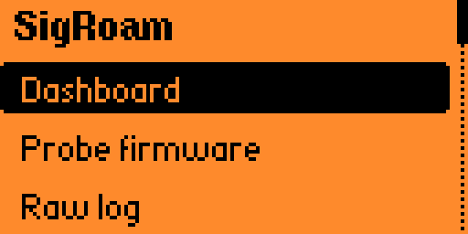
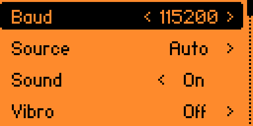
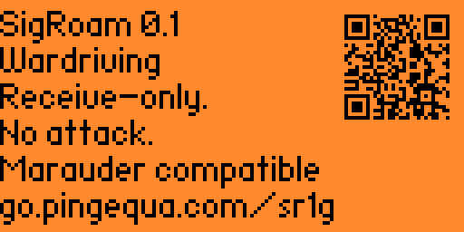

<p align="center">
  
</p>

<h1 align="center">SigRoam</h1>

<p align="center">
  <b>A receive-only Wi-Fi survey (wardriving) front-end for the Flipper Zero.</b><br>
  Drives an external ESP32 Marauder scanner over the GPIO serial port.
</p>

<p align="center">
  <a href="https://github.com/pingequalab/sigroam-wardriving/actions/workflows/host-test.yml"></a>
  <a href="https://github.com/pingequalab/sigroam-wardriving/actions/workflows/fap-build.yml"></a>
  
  
  <a href="LICENSE"></a>
</p>

---

> **What SigRoam is.** SigRoam turns a Flipper Zero into the control head for an
> ESP32 Marauder Wi-Fi scanner. It starts and stops scans over the GPIO serial
> port, shows AP, BLE and GPS counts live, and exposes the raw serial stream. It
> is receive-only by design: no deauthentication, no handshake capture, no attack
> traffic of any kind.

The Flipper does not scan anything by itself. It starts and stops the scan, shows
what the scanner reports in real time, and lets you read the raw serial lines when
something looks wrong.

## Screenshots

| Main menu | Dashboard |
|---|---|
|  |  |
| **Settings** | **About** |
|  |  |

## Quick facts

| | |
|---|---|
| **Platform** | Flipper Zero (FAP), built with [ufbt](https://github.com/flipperdevices/flipperzero-ufbt) |
| **Scanner protocol** | [ESP32 Marauder](https://github.com/justcallmekoko/ESP32Marauder) serial |
| **Serial pins** | 13 (TX), 14 (RX); 5 V on pin 1 |
| **Default baud** | 115200, six choices in Settings |
| **Unique-BSSID estimator** | 4 KB Bloom filter — 32768 bits, 4 hashes, RAM only |
| **Firmware targets** | Official and Momentum, both built in CI |
| **Attack features** | None, permanently — see below |
| **Tests** | Host-side unit tests under gcc and clang, plus ASan/UBSan |
| **License** | GPL-3.0 |

## What it deliberately does not do

SigRoam is **receive-only**. It never transmits attack traffic, and it never will.
The following are permanently out of scope — not "not yet implemented", but a
product rule the project will not accept exceptions to:

- deauthentication / disassociation frames
- WPA handshake capture
- evil twin, karma, or rogue AP
- beacon spam and BLE spam
- password cracking of any kind

The app only parses what the scanner prints. If you need those features, this is
the wrong project.

## Hardware you need

- A Flipper Zero.
- An ESP32-based scanner running [ESP32 Marauder](https://github.com/justcallmekoko/ESP32Marauder)
  firmware, connected to the GPIO header. GPS is optional, but wardriving without
  it only gives you counts, not locations.

Any Marauder-compatible board should work — the app talks the Marauder serial
protocol, not a specific product.

> ### Built for Scout Lite
>
> SigRoam is developed against **[Scout Lite](https://github.com/pingequalab/scout-lite)**
> — ESP32-C5, L86-M33 GPS, microSD — which is what the pin notes below assume.
> It is the reference board for this app: same serial protocol, same power
> budget, same GPS behaviour, no adapter wiring to figure out.
>
> **[→ Scout Lite hardware and build files](https://github.com/pingequalab/scout-lite)**

## Wiring and required setup

| Flipper pin | Use |
|---|---|
| 1 (5V) | Power for the scanner |
| 13 (TX) | Serial to the scanner |
| 14 (RX) | Serial from the scanner |

Two things will stop the app from working if you skip them:

- **`Settings → System → Log Device` must be `Off`.** Pins 13/14 are shared with
  the firmware's serial log. If the log owns them, the app cannot open the port —
  it detects this and says so on screen rather than failing silently.
- **5 V on pin 1 comes from the OTG boost converter, not a permanent rail.** The
  app requests OTG and verifies the physical state before opening the port. Note
  that while USB is plugged in, the firmware defers OTG — so the scanner may have
  no power until you unplug USB and restart the app.

**Do not power the scanner from pin 9 (3.3 V).** It is limited to 150 mA and a
5 GHz-capable ESP32 will exceed that on transmit peaks.

## Interface

The main menu has five entries:

- **Dashboard** — four tabs, switched with left/right:
  - `Dash` — unique BSSID estimate, AP/BLE counts, GPS fix count, bytes received,
    elapsed time. **OK starts and stops the scan.**
  - `Strm` — the most recent parsed records, scrolling.
  - `GPS` — fix status, satellites, coordinates. OK requests a GPS sample.
  - `Sess` — session and diagnostic counters.
- **Probe firmware** — sends `info` and reports what answered, so you can tell
  "nothing connected" from "connected but not Marauder".
- **Raw log** — the raw serial lines, including anything the parser did not
  recognise. This is the first place to look when the numbers look wrong.
- **Settings** — Baud (six choices, default 115200), Source, Sound, Vibro,
  Backlight, Stealth, Debug rows.
- **About** — version, compliance statement, and a QR code to this repository.

While a scan is running, Back returns to the main menu **without stopping the
scan**. Stopping is done only with OK on the Dash tab.

## Where the survey data goes

**SigRoam does not write survey data to the Flipper's SD card.** The only thing it
persists on the Flipper is your settings.

Logging is the scanner's job: Marauder writes its own CSV to the SD card on the
scanner board, and that file is what you upload to [WiGLE](https://wigle.net/).
SigRoam gives you control and live visibility over that session; it is not a
second recorder.

The unique-BSSID number on the Dash tab is an estimate from a 4 KB Bloom filter
(32768 bits, 4 hashes), kept in RAM for the session only. It can undercount
slightly at high AP densities by design — it is a progress indicator, not the
record of what you collected.

## Building

Built with [ufbt](https://github.com/flipperdevices/flipperzero-ufbt).

```bash
ufbt              # build
ufbt launch       # build, install, and run on a connected Flipper
ufbt cli          # device log
```

Host-side unit tests cover the pure-logic layer (line assembly, parsers, model,
Bloom filter) and run without a Flipper:

```bash
make -C tools/host_test        # guards + tests
make -C tools/host_test asan   # same, with ASan/UBSan
```

## Firmware compatibility

Builds against **Official** and **Momentum** firmware from the same source; both
are checked in CI. Unleashed builds too but is not part of the regular pipeline.

The app uses only the common Flipper API — no firmware-specific headers — so it
builds against the Official SDK, which the Flipper Apps Catalog requires.

## FAQ

**Does SigRoam scan Wi-Fi on its own?**
No. The Flipper Zero has no Wi-Fi radio. SigRoam is the control head; an external
ESP32 Marauder board does the scanning and the logging.

**Can it capture handshakes or send deauth frames?**
No, and it never will. Those features are permanently out of scope as a product
rule, not a missing feature. The app is receive-only and only parses what the
scanner prints.

**Where is the survey data stored?**
On the scanner's own microSD card, written by Marauder as CSV. SigRoam persists
only your settings on the Flipper. The CSV is what you upload to WiGLE.

**Why does the scanner have no power when USB is plugged in?**
5 V on pin 1 comes from the OTG boost converter. While USB is connected, the
Flipper firmware defers OTG, so pin 1 stays off. Unplug USB and restart the app.

**Why does the app say the serial port is busy?**
Pins 13/14 are shared with the firmware's serial log. Set
`Settings → System → Log Device` to `Off`.

**Which firmware does it need?**
Official or Momentum; both are built in CI from the same source. It uses only the
common Flipper API, so it also builds against the Official SDK required by the
Flipper Apps Catalog.

**Which hardware is recommended?**
Any Marauder-compatible ESP32 board works. [Scout Lite](https://github.com/pingequalab/scout-lite)
is the reference board this app is developed against.

## License

GPL-3.0. See [LICENSE](LICENSE).

---

<p align="center">
  <b>PINGEQUA_Lab</b> — hardware and firmware for RF, GPS and field survey work.<br>
  <a href="https://pingequa.com">pingequa.com</a> &nbsp;·&nbsp;
  <a href="https://github.com/pingequalab/scout-lite">Scout Lite scanner board</a> &nbsp;·&nbsp;
  <a href="https://github.com/pingequalab">More tools</a>
</p>
